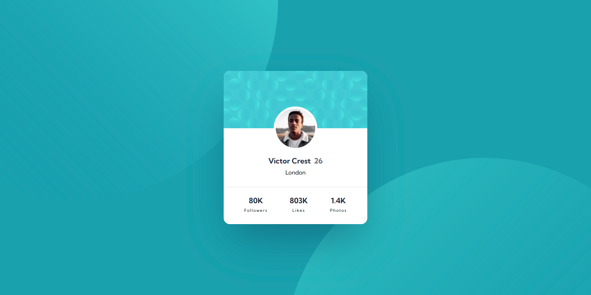
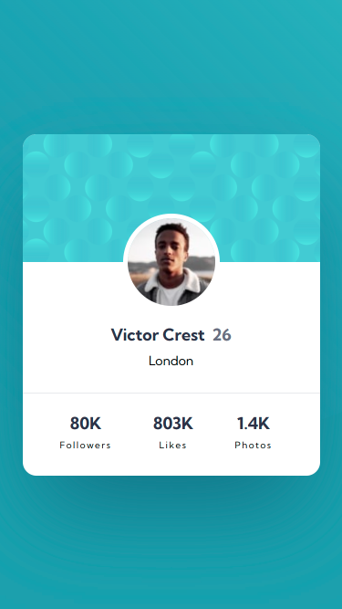

# Frontend Mentor - Profile card component solution

This is a solution to the [Profile card component challenge on Frontend Mentor](https://www.frontendmentor.io/challenges/profile-card-component-cfArpWshJ). Frontend Mentor challenges help you improve your coding skills by building realistic projects. 

## Table of contents

- [Overview](#overview)
  - [The challenge](#the-challenge)
  - [Screenshot](#screenshot)
  - [Links](#links)
- [My process](#my-process)
  - [Built with](#built-with)
  - [What I learned](#what-i-learned)
  - [Continued development](#continued-development)
  - [Useful resources](#useful-resources)
- [Author](#author)

## Overview

This is a simple profile card component just like one you may see in social media. Its design is simple and fairly straight forward. 

The reason I chose this challenge was to practice a new system of CSS organization: GPS. It is organized according to:
- Global settings
- Page settings
- Section settings

### The challenge

- Build out the project to the designs provided

### Screenshot

### Links

- Solution URL: [GitHub Repository](https://github.com/jguleserian/FMC-ProfileCardComponent.git)
- Live Site URL: [GitHub Pages](https://jguleserian.github.io/FMC-ProfileCardComponent.git/)

## My process

This project was created utilizing my established workflow. However, as I am practicing a new stylesheet organization, see below for a reference to the parameters as defined by Jeff Escalante.

### Built with

- Semantic HTML5 markup
- CSS custom properties
- Flexbox
- Mobile-first workflow
- GPS

### What I learned

While this was a simple project, I ended up spending quite a bit of time trying to get the background elements placed according to the model utilizing something systematic. In the end, I opted for just placing them manually.

### Continued development

Next steps:
1. Move on to the "Junior"level of Frontend Mentor. I have stayed inthe "Newbie"category for quite a while trying to get a lot of quick practice and develop a workflow. I feel like I am comfortable with this process and have met my goals. I'm sure I will see the increase in difficulty on my next project.
2. Take GPS to the next level.
3. Take on more JavaScript projects, and perhaps some with Node.js.

### Useful resources

- [Jeff Escalante's GPS System for organizing CSS](https://github.com/jescalan/gps) - This system made more sense to me, in terms of effeciency of code than the ever-popular BEM system. 

## Author

- Frontend Mentor - [@jguleserian](https://www.frontendmentor.io/profile/jguleserian)
- GitHub - [@jguleserian](https://www.github.com/jguleserian)
- LinkedIn - [@jeffguleserian](https://www.linkedin.com/in/jeffguleserian/)
